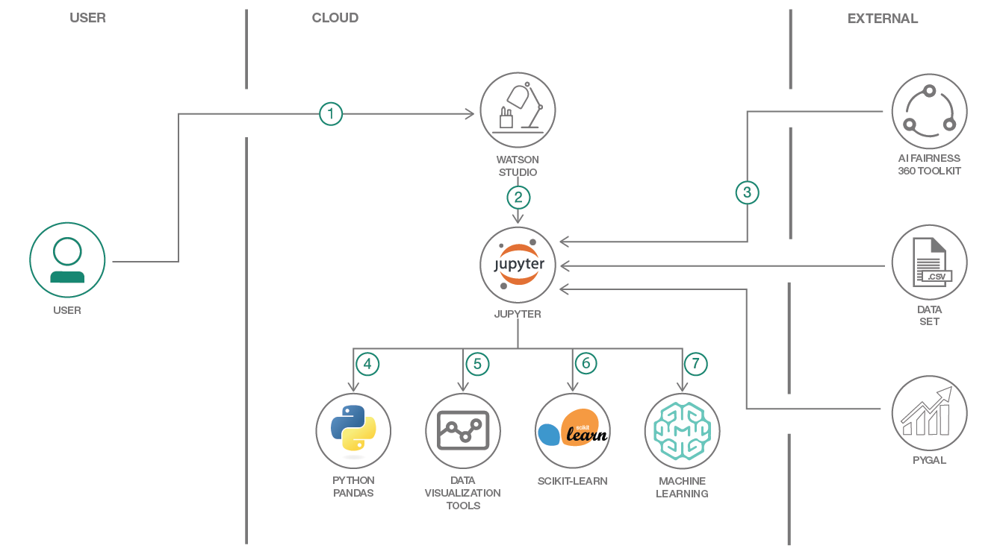
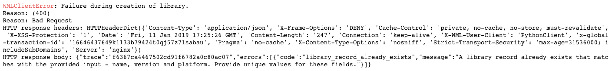

# Data Science Process Pipeline in action to solve Employee Attrition Problem

This code pattern is a high-level overview of what to expect in a data science pipeline and the tools that can be used along the way. It starts from framing the business question, to buiding and deploying a data model. The pipeline is demonstrated through the employee attrition problem.

Employees are the backbone of any organization. Its performance is heavily based on the quality of the employees and retaining them. With employee attrition, organizations are faced with a number of challenges:

1. Expensive in terms of both money and time to train new employees
1. Loss of experienced employees
1. Impact on productivity
1. Impact on profit

The following solution is designed to help address the employee attrition problem. When the reader has completed this code pattern, they will understand:

1. The Process involved in solving a data science problem
1. How to create and use Watson Studio instance
1. How to mitigate bias by transforming the original dataset through use of the AI Fairness 360 (AIF360) toolkit
1. How to build and deploy the model in Watson Studio using various tools

The dataset used in the code pattern is supplied by [Kaggle](https://www.kaggle.com/) and contains HR analytics data of employees that stay and leave. The types of data include metrics such as education level, job satisfactions, and commmute distance.

The data is made available under the following license agreements:

### Dataset License Details
| Asset | License | Source Link |
| ------------- | --------  | -------- |
| [Employee Attrition Data - Database License](data/emp_attrition.csv) | [Open Database License (ODbL)](https://opendatacommons.org/licenses/odbl/1.0/) | [Kaggle](https://www.kaggle.com/pavansubhasht/ibm-hr-analytics-attrition-dataset/home) |
| [Employee Attrition Data - Content License](data/emp_attrition.csv) | [ Database Content license (DbCL)](https://opendatacommons.org/licenses/dbcl/1.0/) | [Kaggle](https://www.kaggle.com/pavansubhasht/ibm-hr-analytics-attrition-dataset/home) |

## Flow



1. Create and login to the IBM Watson Studio.
1. Upload the jupyter notebook and start running it.
1. Notebook downloads the dataset and imports fairness toolkit (AIF360) and Pygal data visualization library.
1. Pandas is used for reading the data and perform initial data exploration.
1. Matplotlib, Seaborn, Plotly, Bokeh and Pygal (from step-3) are used for visualizing the data.
1. Scikit-Learn and AIF360 (from step-3) are used for model development.
1. Use the IBM Watson Machine Learning feature to deploy and access the model to generate employee attrition classification.

## Included Components

* [IBM Watson Studio](https://www.ibm.com/bs-en/marketplace/data-science-experience): Analyze data using RStudio, Jupyter, and Python in a configured, collaborative environment that includes IBM value-adds, such as managed Spark.
* [IBM Watson Machine Learning](https://cloud.ibm.com/catalog/services/machine-learning): a set of REST APIs to develop applications that make smarter decisions, solve tough problems, and improve user outcomes.
* [Jupyter Notebook](http://jupyter.org/): An open source web application that allows you to create and share documents that contain live code, equations, visualizations, and explanatory text.

## Featured technologies

* [Artificial Intelligence](https://medium.com/ibm-watson): Artificial intelligence can be applied to disparate solution spaces to deliver disruptive technologies.
* [Data Science](https://medium.com/ibm-watson): Systems and scientific methods to analyze structured and unstructured data in order to extract knowledge and insights.
* [Python](https://www.python.org/): Python is a programming language that lets you work more quickly and integrate your systems more effectively.
* [Pandas](http://pandas.pydata.org/): A Python library providing high-performance, easy-to-use data structures.
* [AIF360 Fairness toolkit](http://aif360.mybluemix.net/): This extensible open source toolkit can help you examine, report, and mitigate discrimination and bias in machine learning models throughout the AI application lifecycle.
* [Scikit-Learn](https://scikit-learn.org/stable/#): Free software machine learning library for the Python programming language.
* Data Visualization tools: Bokeh, Matplotlib, Seaborn, Pygal and Plotly.

## Steps

1. [Create a new Watson Studio project](#1-create-a-new-watson-studio-project)
1. [Create the notebook](#2-create-the-notebook)
1. [Run the notebook](#3-run-the-notebook)
1. [Save and Share](#4-save-and-share)

> Note: if you would prefer to skip the following steps and just follow along by viewing the completed Notebook, simply:
> * View the completed [notebook](examples/employee-attrition.ipynb) and its outputs, as is.
> * While viewing the notebook, you can optionally download it to store for future use.

### 1. Create a new Watson Studio project

* Log into IBM's [Watson Studio](https://dataplatform.cloud.ibm.com). Once in, you'll land on the dashboard.

* Create a new project by clicking `+ New project` and choosing `Data Science`:

  

* Enter a name for the project name and click `Create`.

> **NOTE**: By creating a project in Watson Studio a free tier `Object Storage` service and `Watson Machine Learning` service will be created in your IBM Cloud account. Select the `Free` storage type to avoid fees.


* Upon a successful project creation, you are taken to a dashboard view of your project. Take note of the `Assets` and `Settings` tabs, we'll be using them to associate our project with any external assets (datasets and notebooks) and any IBM cloud services.


## 2. Create the Notebook

The notebook we'll be using can be viewed in [`notebooks/employee-attrition.ipynb`](notebooks/employee-attrition.ipynb), and a completed version can be found in [`examples/employee-attrition.ipynb`](examples/employee-attrition.ipynb).

* From the new project `Overview` panel, click `+ Add to project` on the top right and choose the `Notebook` asset type.


* Fill in the following information:

  * Select the `From URL` tab. [1]
  * Enter a `Name` for the notebook and optionally a description. [2]
  * Under `Notebook URL` provide the following url: [https://github.com/IBM/employee-attrition-aif360/blob/master/notebooks/employee-attrition.ipynb](https://github.com/IBM/employee-attrition-aif360/blob/master/notebooks/employee-attrition.ipynb) [3]
  * For `Runtime` select the `Python 3.5` option. [4]

  

* **TIP:** Once successfully imported, the notebook should appear in the `Notebooks` section of the `Assets` tab.

## 3. Run the notebook

When running the notebook, you will come to the cell that requires you to enter your `Watson Machine Learning` instance credentials. These will be required to complete the notebook. Refer to `step #1` above for more details.

When a notebook is executed, what is actually happening is that each code cell in
the notebook is executed, in order, from top to bottom.

Each code cell is selectable and is preceded by a tag in the left margin. The tag
format is `In [x]:`. Depending on the state of the notebook, the `x` can be:

* A blank, this indicates that the cell has never been executed.
* A number, this number represents the relative order this code step was executed.
* A `*`, this indicates that the cell is currently executing.

There are several ways to execute the code cells in your notebook:

* One cell at a time.
  * Select the cell, and then press the `Play` button in the toolbar.
* Batch mode, in sequential order.
  * From the `Cell` menu bar, there are several options available. For example, you
    can `Run All` cells in your notebook, or you can `Run All Below`, that will
    start executing from the first cell under the currently selected cell, and then
    continue executing all cells that follow.
* At a scheduled time.
  * Press the `Schedule` button located in the top right section of your notebook
    panel. Here you can schedule your notebook to be executed once at some future
    time, or repeatedly at your specified interval.

## 4. Save and Share

### How to save your work:

Under the `File` menu, there are several ways to save your notebook:

* `Save` will simply save the current state of your notebook, without any version
  information.
* `Save Version` will save your current state of your notebook with a version tag
  that contains a date and time stamp. Up to 10 versions of your notebook can be
  saved, each one retrievable by selecting the `Revert To Version` menu item.

### How to share your work:

You can share your notebook by selecting the `Share` button located in the top
right section of your notebook panel. The end result of this action will be a URL
link that will display a “read-only” version of your notebook. You have several
options to specify exactly what you want shared from your notebook:

* `Only text and output`: will remove all code cells from the notebook view.
* `All content excluding sensitive code cells`:  will remove any code cells
  that contain a *sensitive* tag. For example, `# @hidden_cell` is used to protect
  your credentials from being shared.
* `All content, including code`: displays the notebook as is.
* A variety of `download as` options are also available in the menu.

## Sample output

View a copy of the notebook including output [here](examples/employee-attrition.ipynb).

## Troubleshooting

* Notebook error:

  

  This will occur if you run the notebook multiple times. The custom library `NAME` found in the structure below must be unique for each run. Change the value and run the cell again.

  ```python
  library_metadata = {
        client.runtimes.LibraryMetaNames.NAME: "PipelineLabelEncoder-Custom",
        client.runtimes.LibraryMetaNames.DESCRIPTION: "label_encoder_sklearn",
        client.runtimes.LibraryMetaNames.FILEPATH: "Pipeline_LabelEncoder-0.1.zip",
        client.runtimes.LibraryMetaNames.VERSION: "1.0",
        client.runtimes.LibraryMetaNames.PLATFORM: {"name": "python", "versions": ["3.5"]}
  }
  ```

## Learn more

* **Artificial Intelligence Code Patterns**: Enjoyed this Code Pattern? Check out our other [AI Code Patterns](https://developer.ibm.com/technologies/artificial-intelligence/).
* **Data Analytics Code Patterns**: Enjoyed this Code Pattern? Check out our other [Data Analytics Code Patterns](https://developer.ibm.com/technologies/data-science/)
* **AI and Data Code Pattern Playlist**: Bookmark our [playlist](https://www.youtube.com/playlist?list=PLzUbsvIyrNfknNewObx5N7uGZ5FKH0Fde) with all of our Code Pattern videos
* **With Watson**: Want to take your Watson app to the next level? Looking to utilize Watson Brand assets? [Join the With Watson program](https://www.ibm.com/watson/with-watson/) to leverage exclusive brand, marketing, and tech resources to amplify and accelerate your Watson embedded commercial solution.
* **Watson Studio**: Master the art of data science with IBM's [Watson Studio](https://dataplatform.cloud.ibm.com/)

## License

This code pattern is licensed under the Apache License, Version 2. Separate third-party code objects invoked within this code pattern are licensed by their respective providers pursuant to their own separate licenses. Contributions are subject to the [Developer Certificate of Origin, Version 1.1](https://developercertificate.org/) and the [Apache License, Version 2](https://www.apache.org/licenses/LICENSE-2.0.txt).

[Apache License FAQ](https://www.apache.org/foundation/license-faq.html#WhatDoesItMEAN)
