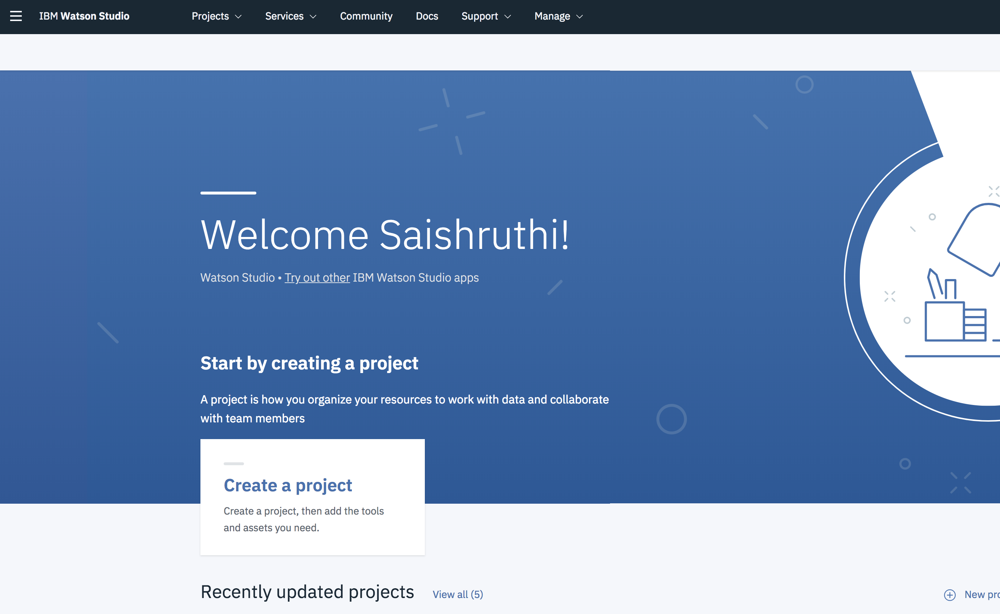
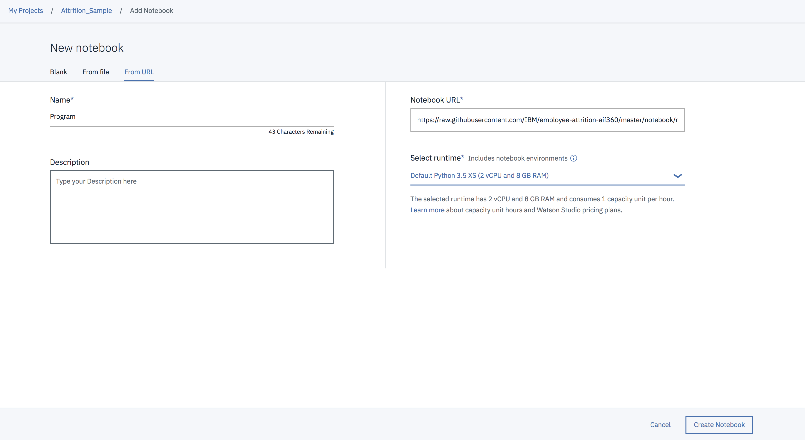

# Data Science Process Pipeline in action to solve Employee Attrition Problem

This code pattern is a high level overview of what to expect in a data science pipeline and tools that can be used along the way. It starts from framing business question to deploying the model. The pipeline is demonstrated through the employee attrition problem.

Employees are the backbone of the organization. Organization's performance is heavily based on the quality of the employees. Challenges that an organization has to face due employee attrition are:

1. Expensive in terms of both money and time to train new employees.
2. Loss of experienced employees
3. Impact in productivity
4. Impact profit

The following solution is designed to help address the employee attrition problem. When the reader has completed this code pattern, they will understand:

1. Process involved in solving a data science problem.
2. How to create and use watson studio instance.
3. How to mitigate bias by transforming the original dataset.
4. How to build and deploy the model in Watson Studio using various tools.

# Dataset License Details
| Asset | License | Source Link |
| ------------- | --------  | -------- | 
| [Employee Attrition Data](data/emp_attrition.csv) | [Database license](https://opendatacommons.org/licenses/odbl/1.0/) | [Kaggle](https://www.kaggle.com/pavansubhasht/ibm-hr-analytics-attrition-dataset/home) |
| [Employee Attrition Data](data/emp_attrition.csv) | [Content license](https://opendatacommons.org/licenses/dbcl/1.0/) | [Kaggle](https://www.kaggle.com/pavansubhasht/ibm-hr-analytics-attrition-dataset/home) |

# Flow

1. Open Watson Studio and create a project using Jupyter notebook and Python 3.5.
2. Upload the notebook under the project created.
3. Download the data in Watson studio and start exploring using various exploring and visulaization tools.
4. Notebook also imports the AI Fairness 360 toolkit in model development phase of data science process.
5. Run the entire notebook to deploy the model.

# Included Components

1. [IBM Watson Studio](https://www.ibm.com/bs-en/marketplace/data-science-experience): Analyze data using RStudio, Jupyter, and Python in a configured, collaborative environment that includes IBM value-adds, such as managed Spark.
2. [Jupyter Notebook](http://jupyter.org/): An open source web application that allows you to create and share documents that contain live code, equations, visualizations, and explanatory text.
3. [AIF360 Fairness toolkit](http://aif360.mybluemix.net/): This extensible open source toolkit can help you examine, report, and mitigate discrimination and bias in machine learning models throughout the AI application lifecycle.
4. [Scikit-Learn](https://scikit-learn.org/stable/#): Free software machine learning library for the Python programming language.
5. Data Visualization tools: Bokeh, Matplotlib, Seaborn, Pygal and Plotly

# Featured technologies

1. [Artificial Intelligence](https://medium.com/ibm-watson): Artificial intelligence can be applied to disparate solution spaces to deliver disruptive technologies.
2. [Data Science](https://medium.com/ibm-watson): Systems and scientific methods to analyze structured and unstructured data in order to extract knowledge and insights.
3. [Python](https://www.python.org/): Python is a programming language that lets you work more quickly and integrate your systems more effectively.
4. [pandas](http://pandas.pydata.org/): A Python library providing high-performance, easy-to-use data structures.

# Steps to run and deploy the model in Watson Studio

1. Sign up for IBM's Watson Studio.
2. Click the Create a Project tile and choose the Data Science service tile from the next screen. This is the best choice for a Jupyter notebook based project.

3. Create new project under the data science service and provide necessary details.

4. Click on `Add to Project` from the `Assets` option and select notebook from the provided list. 

5. Upload the notebook by using using the below URL by choosing `FROM URL` option. 
   URL: `https://raw.githubusercontent.com/IBM/employee-attrition-aif360/master/notebook/notebook_emp_attrition.ipynb`

6. Use the menu pull-down Cell > Run All to run the notebook, or run the cells one at a time top-down using the play button.
   As the cells run, watch the output for results or errors. A running cell will have a label like In [*]. A completed cell      will have a run sequence number instead of the asterisk.
7. Update WML credentials under deployment heading to facilitate model deployment. Note: Name given for the custom library in 
   the custom library metadata step must be unique everytime ('client.runtimes.LibraryMetaNames.NAME'- this place).
8. Check deployment model using own input by changing values in scoring payload cell.

# Learn more

* **Artificial Intelligence Code Patterns**: Enjoyed this Code Pattern? Check out our other [AI Code Patterns](https://developer.ibm.com/code/technologies/artificial-intelligence/).
* **Data Analytics Code Patterns**: Enjoyed this Code Pattern? Check out our other [Data Analytics Code Patterns](https://developer.ibm.com/code/technologies/data-science/)
* **AI and Data Code Pattern Playlist**: Bookmark our [playlist](https://www.youtube.com/playlist?list=PLzUbsvIyrNfknNewObx5N7uGZ5FKH0Fde) with all of our Code Pattern videos
* **With Watson**: Want to take your Watson app to the next level? Looking to utilize Watson Brand assets? [Join the With Watson program](https://www.ibm.com/watson/with-watson/) to leverage exclusive brand, marketing, and tech resources to amplify and accelerate your Watson embedded commercial solution.
* **Data Science Experience**: Master the art of data science with IBM's [Data Science Experience](https://datascience.ibm.com/)

# License
This code pattern is licensed under the Apache Software License, Version 2.  Separate third party code objects invoked within this code pattern are licensed by their respective providers pursuant to their own separate licenses. Contributions are subject to the [Developer Certificate of Origin, Version 1.1 (DCO)](https://developercertificate.org/) and the [Apache Software License, Version 2](http://www.apache.org/licenses/LICENSE-2.0.txt).

[Apache Software License (ASL) FAQ](http://www.apache.org/foundation/license-faq.html#WhatDoesItMEAN)

